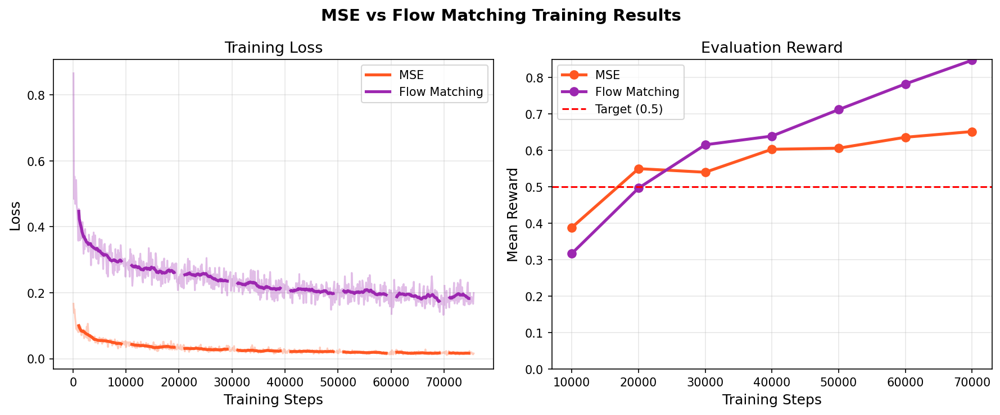

# MSE Policy Report

## Architecture

The MSE policy uses a multi-layer perceptron (MLP) with the following architecture:

| Component | Details |
|-----------|---------|
| Input | 5-dimensional state vector (T position x/y, T angle, agent position x/y) |
| Hidden Layer 1 | 256 units, ReLU activation |
| Hidden Layer 2 | 256 units, ReLU activation |
| Hidden Layer 3 | 256 units, ReLU activation |
| Output | chunk_size × action_dim = 8 × 2 = 16 values, reshaped to (8, 2) |
| Loss Function | Mean Squared Error (MSE) |
| Optimizer | Adam, lr = 3e-4, weight decay = 0.0 |
| Batch Size | 128 |
| Training Epochs | 400 |
| Chunk Size | 8 |

## Results

- Final training loss: **0.0162**
- Final evaluation reward: **0.651** (target: ≥ 0.5 ✓)

## Training Curves

*Left: MSE training loss over 75,600 steps. Loss decreased from 0.167 to 0.016, showing stable convergence. Right: Evaluation reward over training. Reward exceeded the 0.5 target after 20,000 steps and reached 0.651 by the end of training.*
