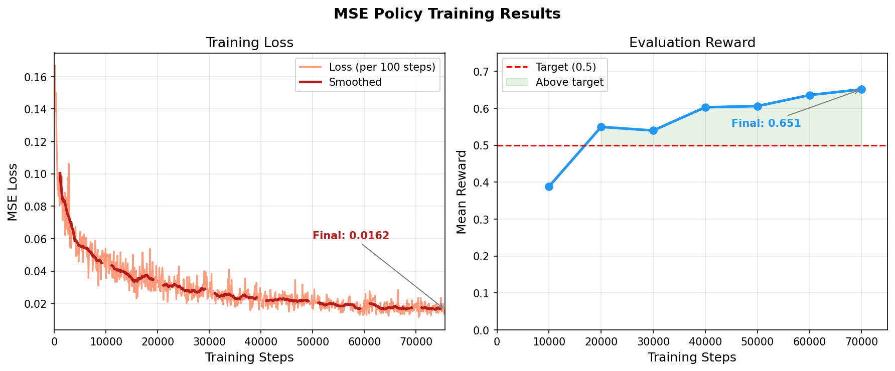

# Imitation Learning Report

## MSE Policy

### Architecture

| Component | Details |
|-----------|---------|
| Input | 5-dimensional state vector (T position x/y, T angle, agent position x/y) |
| Hidden Layer 1 | 256 units, ReLU activation |
| Hidden Layer 2 | 256 units, ReLU activation |
| Hidden Layer 3 | 256 units, ReLU activation |
| Output | chunk_size × action_dim = 8 × 2 = 16 values, reshaped to (8, 2) |
| Loss Function | Mean Squared Error (MSE) |
| Optimizer | Adam, lr = 3e-4, weight decay = 0.0 |
| Batch Size | 128 |
| Training Epochs | 400 |
| Chunk Size | 8 |

### Results
- Final training loss: **0.0162**
- Final evaluation reward: **0.651**

---

## Flow Matching Policy

### Architecture

| Component | Details |
|-----------|---------|
| Input | state (5) + current A flattened (8×2=16) + τ (1) = 22 dimensions |
| Hidden Layer 1 | 256 units, ReLU activation |
| Hidden Layer 2 | 256 units, ReLU activation |
| Hidden Layer 3 | 256 units, ReLU activation |
| Output | chunk_size × action_dim = 8 × 2 = 16 values (predicted velocity direction) |
| Loss Function | Flow Matching Loss |
| Optimizer | Adam, lr = 3e-4, weight decay = 0.0 |
| Batch Size | 128 |
| Training Epochs | 400 |
| Chunk Size | 8 |
| Denoising Steps | 10 |

### Results
- Final training loss: **0.1916**
- Final evaluation reward: **0.831**

---

## Training Curves

---

## Comparison: MSE vs Flow Matching

### Training Loss

The MSE policy achieves a much lower training loss (0.016) compared to Flow Matching (0.192). This is expected — the two losses measure different things and are not directly comparable:

- **MSE loss** measures the difference between the predicted action chunk and the expert action chunk directly.
- **Flow Matching loss** measures the difference between the predicted velocity direction and the true velocity direction, which operates in a different scale.

A lower Flow Matching loss does not mean worse performance — as shown by the reward results.

### Evaluation Reward

Flow Matching significantly outperforms MSE in terms of reward:

| Policy | Final Reward |
|--------|-------------|
| MSE | 0.651 |
| Flow Matching | 0.831 |

Flow Matching achieves a **27% higher reward** than MSE. This confirms the theoretical advantage of Flow Matching: by learning to denoise from noise to action, it can better capture the multimodal distribution of expert actions.

### Qualitative Behavior (from videos)

The Flow Matching policy produces smoother and more decisive trajectories compared to the MSE policy:

- **MSE policy**: Sometimes gets stuck and fails to reach the T block. Occasionally overshoots by pushing the T past the target zone.
- **Flow Matching policy**: More consistently navigates toward and pushes the T into the target zone. Also overshoots occasionally, but to a lesser extent, and recovers more effectively.

Overall, Flow Matching produces more robust and fluid agent behavior, which is reflected in its higher reward.
